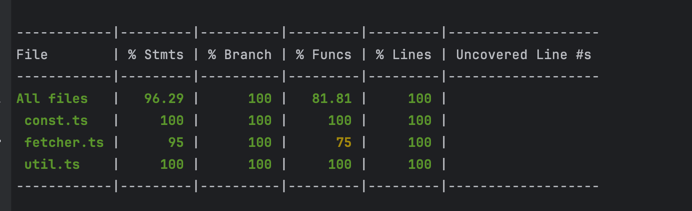

How to run the code 
--------------------
1. Clone the repository
2. Open the terminal and navigate to the project folder
3. Run the following command to install the required packages:
```
nvm use
npm i -g yarn
yarn install
```
4. Run the following command to start the project:
### using TS-NODE
```
yarn dev -- todo 20
yarn dev -- todo 20 -t 10 # gives number of parallel api calls to made
```

```
$ ts-node src/index.ts todo 20 -t 10
Time taken to fetch 20 todos with eventthreads: 10 , Timetaken: 1169 milli seconds


$ ts-node src/index.ts todo 20 -t 20
Time taken to fetch 20 todos with eventthreads: 20 , Timetaken: 818 milli seconds


$ ts-node src/index.ts todo 20 -t 20
Time taken to fetch 20 todos with eventthreads: 20 , Timetaken: 1211 milli seconds

```

### the optimal will be with t as 10 or 20, the time taken will depends upon server capacity and network limit

Converting it to CLI
```
yarn build    
chmod +x ./dist/src/index.js
./dist/src/index.js todo 20 -t 10
# create SYMLINK if we dont want to use entire name
```

To run the test cases

```
jest
jest --coverage
```

